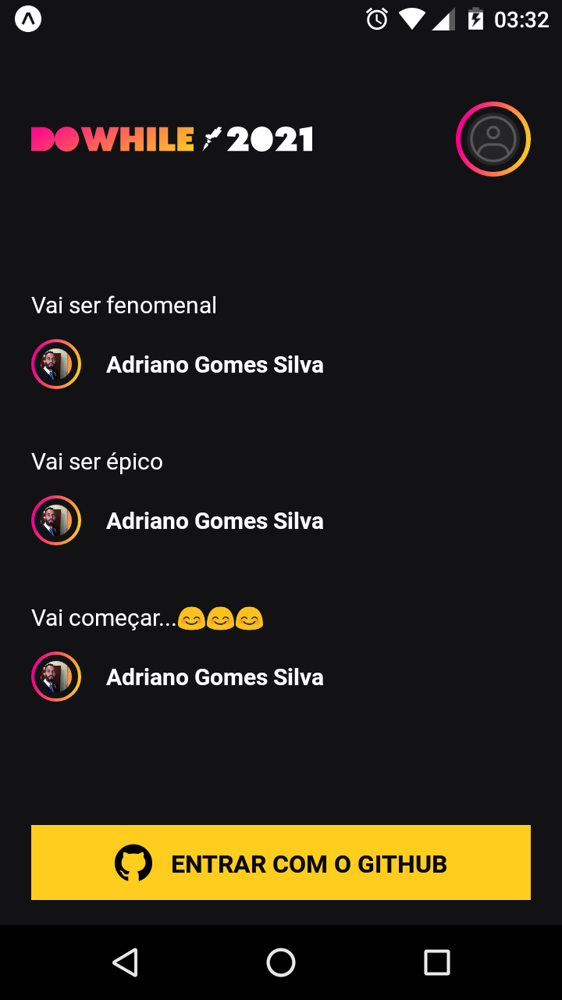

<h1 align="center">React Native Heat</h1>

Aplicação para o envio de mensagens :)

  
  

## Tecnologias

Esse projeto foi desenvolvido com as seguintes tecnologias:

- [React Native](https://reactnative.dev)
- [Expo](https://docs.expo.io)
- [Typescript](https://www.typescriptlang.org)
- [Styled Components](https://www.styled-components.com)
- [Socket.io](https://socket.io/)
- [OAuth - Github](https://www.oauth.com/)

## Projeto

É uma aplicação facilita a interação nas lives/streams através de perguntas onde é necessário a autenticação com o github. A cada 3s a aplicação atualiza as perguntas feitas e exibem para o usuário.

## Para rodar o projeto:

  - Baixe ou clone esse repositório
  - [Baixe ou clone o repositório do backend](https://github.com/Gui-dev/rn-heat)
  - Instale os módulos em ambos os repositórios: `npm install` ou `yarn`
  - No backend:
    - Rode: `npm run dev` ou `yarn dev`
  - No frontend:
    - Rode: `expo start` ou `yarn start`
